# SkillBridge

> 🚀 A modern Android collaboration platform for students to discover projects, connect with developers, and build skill-based teams.


## ✨ Overview

SkillBridge is an Android-based collaboration platform designed for students and early-career developers who want to turn ideas into real projects. The app helps users explore project opportunities, discover people with matching technical interests, post project ideas, and manage collaboration activity from a clean mobile interface.

The project demonstrates practical Android development using Java, XML layouts, SQLite, MVVM-inspired separation, RecyclerView lists, ViewPager2 experiences, Material Design components, and structured app modules.

## 🎯 Problem Statement

Students often have ideas but struggle to find reliable teammates with the right skills, interests, and availability. Existing communication channels are scattered across chats, classroom groups, and social platforms, making collaboration discovery inefficient.

SkillBridge addresses this gap by creating a focused mobile experience where students can:

- Discover projects that match their skills.
- Connect with developers and creators.
- Post collaboration ideas.
- Build project teams around shared interests.
- Track project and notification activity in one place.

## 🌟 Features

- 🔐 Authentication screens for login, registration, and splash flow.
- 🏠 Home feed for recent projects and highlighted creators.
- 🔎 Search experience for projects and people.
- 🤝 Connections screen for skill-based networking.
- 📝 Project posting flow with title, description, skills, and location.
- 📌 Project detail screen with team and application actions.
- 🔔 Notification center with read-state interactions.
- 👤 Profile screen with skills, stats, posted projects, and edit dialog.
- 🗺️ Map activity support for project locations.
- 📱 Material-styled Android UI using XML layouts.

## 🧰 Tech Stack

| Layer | Technology |
| --- | --- |
| Language | Java |
| UI | XML, Material Design Components, ConstraintLayout |
| Architecture | MVVM-inspired structure |
| Data | SQLite, Repository pattern, SharedPreferences |
| Lists | RecyclerView, Adapter classes |
| Navigation/UI | Activities, Fragments, ViewPager2 |
| Services | Android Service, BroadcastReceiver |
| Build | Gradle, Android SDK |

## 🏗️ Architecture

SkillBridge follows a clear separation of responsibilities:

- `ui/` contains Activities, Fragments, dialogs, and screen-level interactions.
- `viewmodel/` exposes UI-facing state and actions.
- `repository/` centralizes access to application data.
- `database/` manages local SQLite persistence.
- `model/` defines core data objects.
- `adapter/` binds lists to RecyclerView screens.
- `service/`, `receiver/`, and `utils/` support sync, network, preferences, sensors, and helper logic.

## 📁 Folder Structure

```text
SkillBridge/
├── app/
│   ├── build.gradle
│   ├── proguard-rules.pro
│   └── src/
│       ├── androidTest/
│       ├── main/
│       │   ├── AndroidManifest.xml
│       │   ├── java/com/skillbridge/app/
│       │   │   ├── adapter/
│       │   │   ├── data/
│       │   │   ├── database/
│       │   │   ├── model/
│       │   │   ├── receiver/
│       │   │   ├── repository/
│       │   │   ├── service/
│       │   │   ├── ui/
│       │   │   ├── utils/
│       │   │   └── viewmodel/
│       │   └── res/
│       └── test/
├── gradle/
├── build.gradle.kts
├── gradle.properties
├── settings.gradle.kts
├── LICENSE
└── README.md
```

## ⚙️ Installation

1. Clone the repository:

```bash
git clone https://github.com/YOUR_USERNAME/SkillBridge-Collaboration-Platform.git
cd SkillBridge-Collaboration-Platform
```

2. Open the project in Android Studio.

3. Let Android Studio sync Gradle dependencies.

4. Add your local SDK configuration if Android Studio does not generate it automatically:

```properties
sdk.dir=C:\\Users\\YOUR_NAME\\AppData\\Local\\Android\\Sdk
```

5. Replace the placeholder Google Maps API key in `app/src/main/AndroidManifest.xml` if map functionality is required:

```xml
android:value="YOUR_MAPS_API_KEY"
```

6. Run the app on an Android emulator or physical device.

## 📦 APK Download

Experience the application directly using the APK below:

➡️ [Download SkillBridge APK](APK/SkillBridge2O.apk)

## 📸 Screenshots

### 🚀 Splash Screen
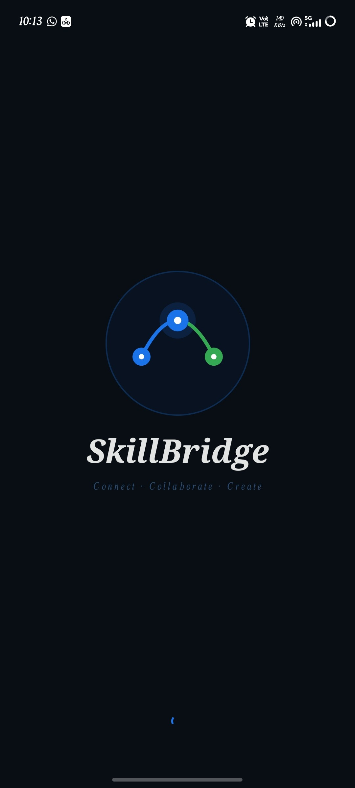

### 🔐 Login Screen
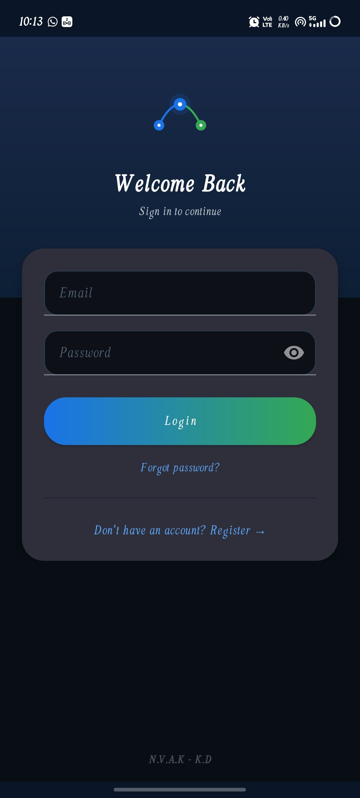

### 📝 Registration Screen
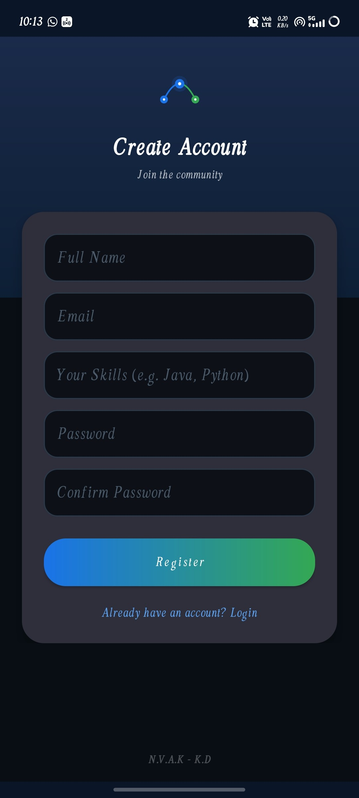

### 🏠 Home Dashboard
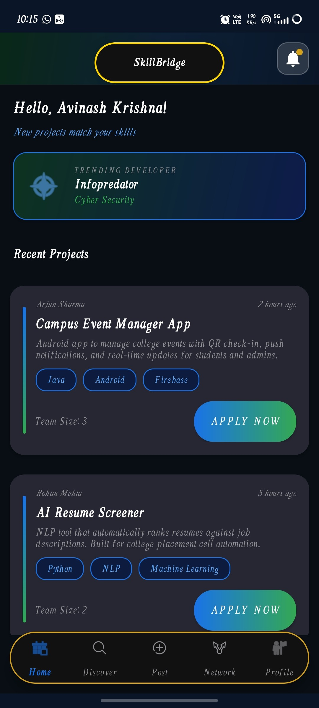

### 🏠 Home Feed
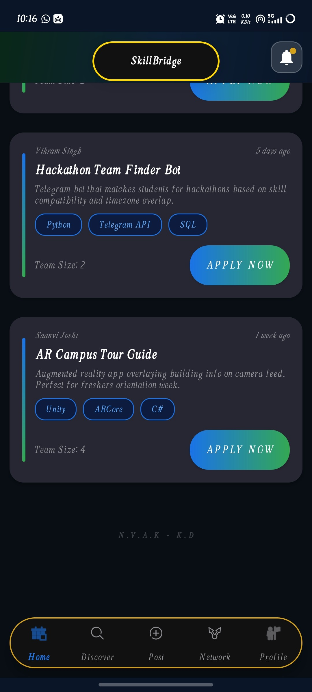

### 🔍 Discover Projects
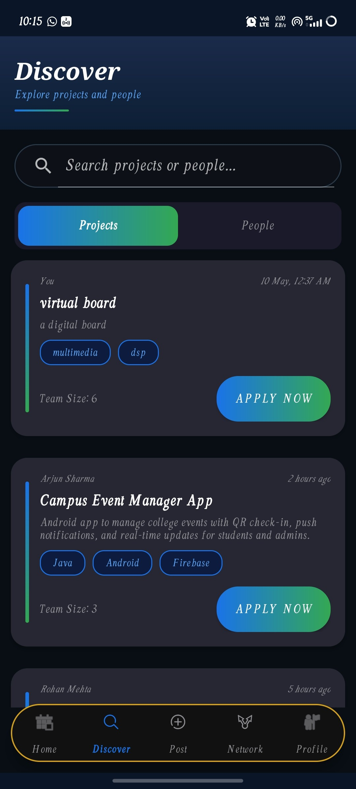

### 👥 Discover People
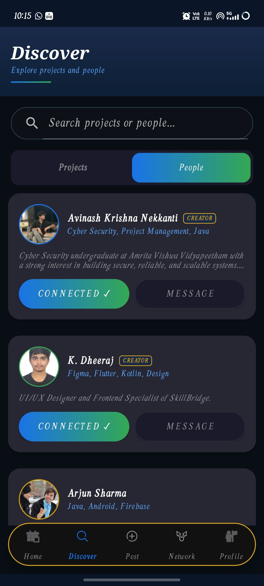

### 🌐 Network Page
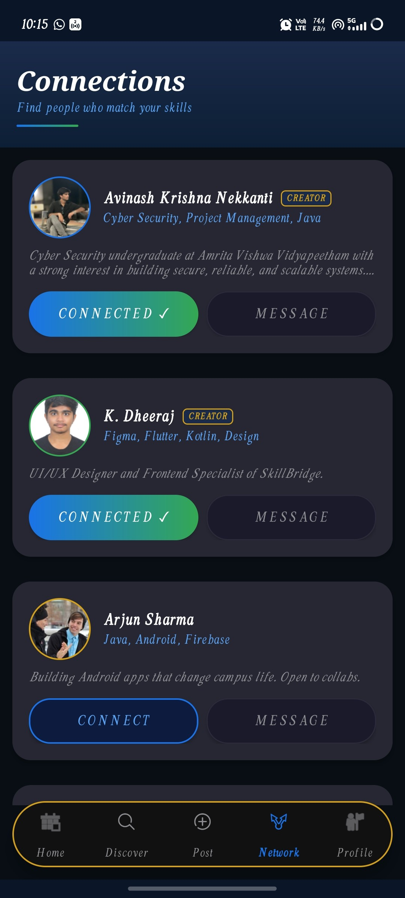

### ➕ Post Project
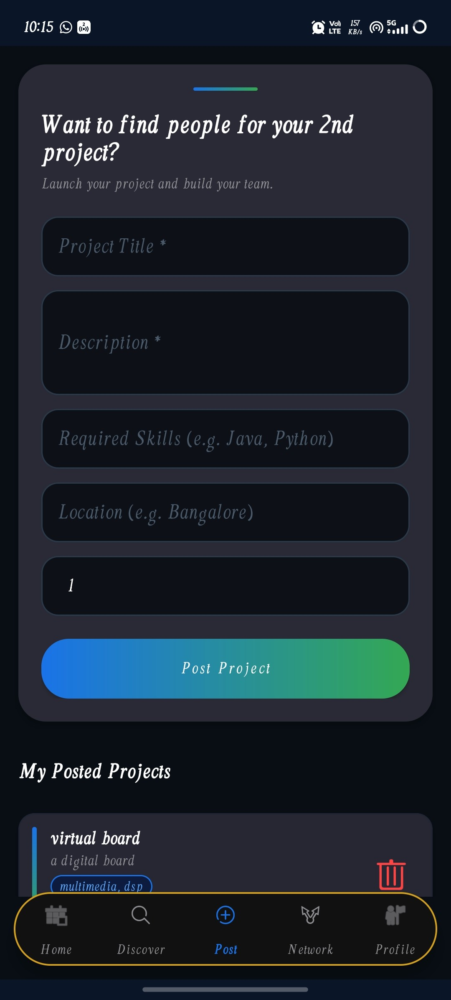

### 🔔 Notifications
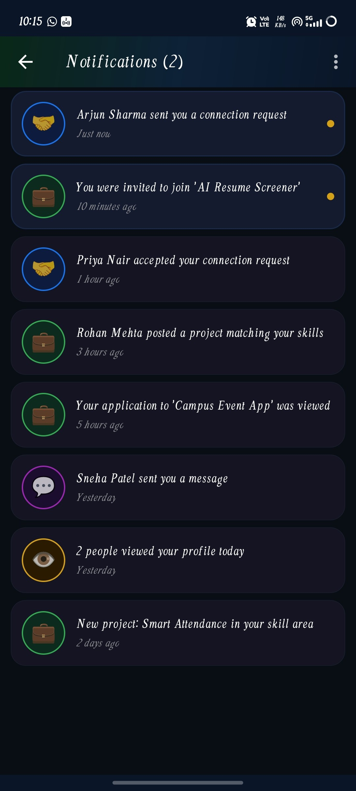

### 📄 Project Details
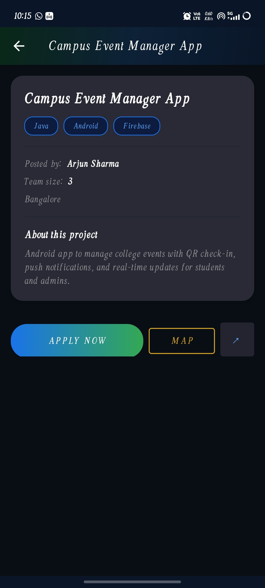

### 👤 Profile Page
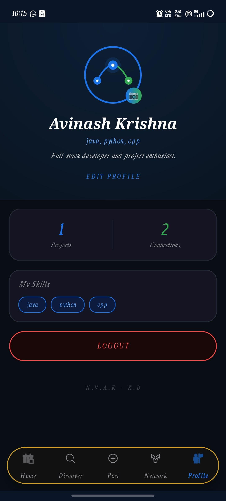

### ✏️ Edit Profile
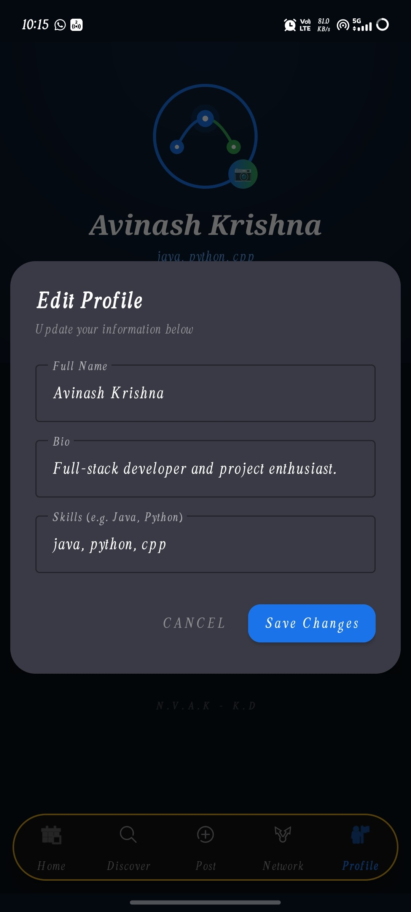

### 🧑‍💻 Creators Page
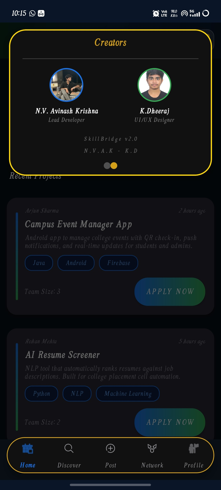

### 🏝️ Profile Island
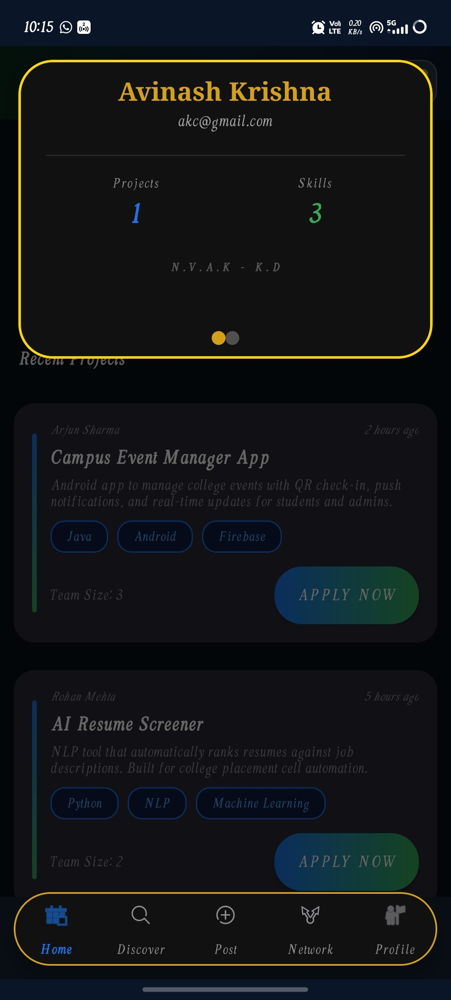

## 🚧 Future Improvements

- Firebase or backend API integration for real user accounts.
- Real-time chat between project creators and applicants.
- Advanced skill-matching recommendations.
- Push notifications for applications and team updates.
- Project bookmarking and saved searches.
- Better offline-first sync and conflict handling.
- UI test coverage for core user flows.


## 📌 Project Status

✅ Active Development  
✅ Portfolio Ready  
✅ Android Studio Compatible  
✅ Public Showcase Project

### v1.0.0 - Portfolio Release

- Initial public portfolio version of SkillBridge.
- Includes authentication flow, project discovery, search, connections, posting, profile, notifications, and map support.
- Repository cleaned for GitHub upload with professional documentation, license, and Android `.gitignore`.

## 👥 Authors

- **Nekkanti Venkata Avinash Krishna**
- **Kommana Dheeraj**

## 🤝 Contribution Note

This project is published as a student portfolio and educational showcase. Suggestions, issue reports, and non-commercial learning-oriented improvements are welcome with proper attribution.

## 📄 License

This project is licensed under the **Creative Commons Attribution-NonCommercial 4.0 International License**.

Commercial usage, redistribution, or academic plagiarism without proper attribution is prohibited.
